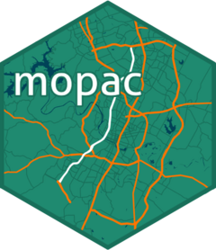

<!-- README.md is generated from README.Rmd. Please edit that file -->

# mopac 

<!-- badges: start -->
<!-- badges: end -->

mopac provides real & simulated datasets based on vehicular observations
from Loop 1 (a.k.a “Mopac”) in Austin, Tx.

## Installation

``` r
devtools::install_github("sccmckenzie/mopac")
```
